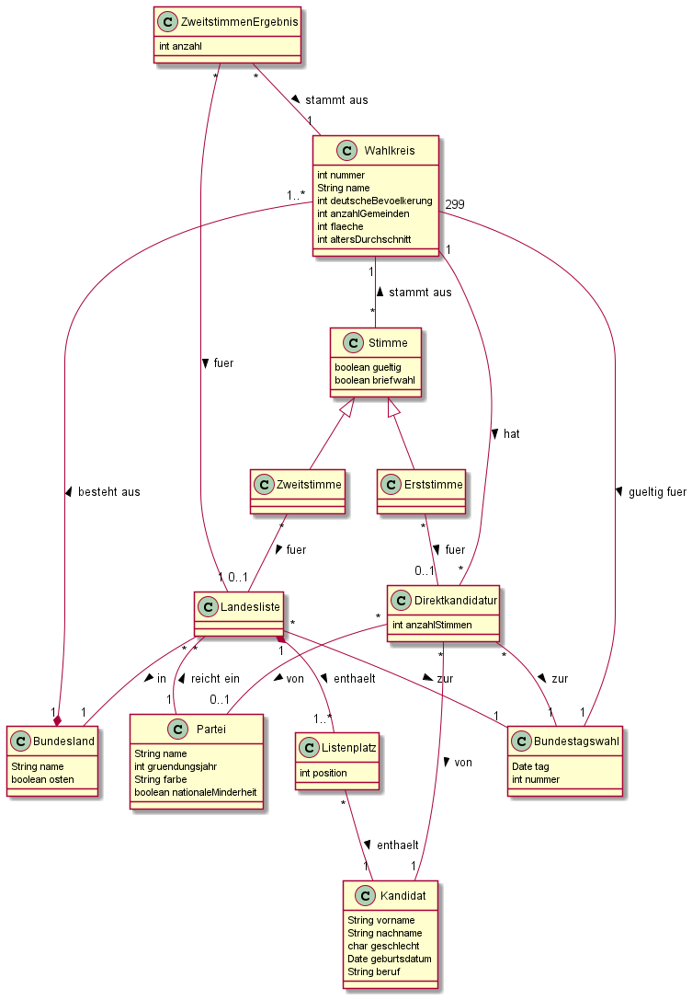

# Pflichtenheft

## Zielsetzung

### Musskriterien
- Speichern aller relevanten Daten (siehe Datenmodell) für die BTW
- Sitzverteilung des Bundestags
  - Berechnung der Verteilung auf die Parteien unter Beachtung von Sonderregeln:
    - Überhangsmandate (außer die ersten drei)
    - nationale Minderheiten
    - 5%-Hürde
  - Ausgabe der Anteile und Sitze pro Partei
  - Visualisierung als Diagramm
  - Bestimmung des Mandatstyps (Überhangsmandat, Direktmandat, Listenmandat)
  - Besetzung der Sitze mit Kandidaten
- Möglicher Vergleich aller Ausgaben (von 2021) mit der Wahl 2017
- Stimmabgabe durch Benutzer
  - Einzeln
  - Batch-Loading

### Sollkriterien
- ausführliche Dokumentation und Versionierung
- Ausgabe von gespeicherten Daten
  - Parteien
  - Wahlkreise (inklusive Wahlkreisinformationen)
  - Kandidaten
  - Landeslisten
- Ausgabe von Statistiken
  - Erst- und Zweitstimmenergebnis für ein Bundesland oder einen Wahlkreis
  - Anteil Briefwahl
  - Anteil ungültiger Stimmen
- interaktive Karte Deutschlands
  - in Wahlkreise und Bundesländer unterteilt
  - Darstellung der jeweiligen Ergebnisse (Erst-/Zweitstimme)

### Kannkriterien
- Filter und Suche in den Daten
- Weitere visuelle Darstellung
  - Heatmap für jede Partei, die zeigt in welchen Gebieten eine Partei am 
    stärksten abgeschnitten hat
- Weitere Statistiken
  - knappster/deutlichster Erststimmensieg
  - Wählerumzug (innerhalb von Wahlkreisen)
  - größter Gewinner/Verlierer
  - Frauenanteil im Bundestag
  - Gegenüberstellung von alten und neuen Bundesländern

### Abgrenzungskriterien
- keine Möglichkeit eigene (SQL-)Anfragen zu formulieren
- keine Einzelstimmen für Wahlen vor 2021
- keine Neuberechnung des Bundestags bei jeder Abfrage
- keine personenbezogenen Daten (insbesondere über Wähler) speichern

## Technische Umsetzung

### Datenbankmanagementsystem
- PostgreSQL
  - alle persistenten Daten

### Backend
- Python + Flask
- Interpretation der REST-API Aufrufe
- Delegation zum DBMS (psycopg)
- Berechnung der tatsächlichen Wahlkreisgrenzen als (konkaves) Polygon

### Frontend
- Angular mit Typescript
- Mapbox GL JS
  - interaktive Map
- GeoJSON
  - Wahlkreisgrenzen

## Datenmodell

## GUI-Mockup
- Navigationsleiste (oben):
  - Titel und Logo
  - **Bundestag** 
  - Daten (Parteien, Landeslisten, Kandidaten, Wahlkreisdaten)
  - Karten (Interaktive Karte, Heatmap)
  - Statistiken
  - Timeslider für Auswahl der Wahl (ein zusätzlicher Slider für Vergleich)
- Bundestag
  - Genaue Sitzverteilung + Gesamtanzahl
  - Filter für "einfache" Statistiken (Frauenanteil, Überhangsmandate, etc.)
  -
- Liste an Parteien ( + Suche/Filter)
- Parteiübersicht mit Landeslisten + Ergebnissen
  - Landeslisten mit Kandidaten (+ Suche/Filter) + Ergebnissen (farblich kennzeichnen)
  - Listenkandidatenübersicht + Einzug ja/nein 

  ODER

  - Liste an allen Direktkandidaten
  - Direktkandidatenübersicht + Ergebnisse

- liste an Wahlkreisen
- Wahlkreisübersicht + Daten + Liste an Direktkandidaten + Ergebnisse
- Statistiken
  - Gruppierung von mehreren Statistiken
  - Dropdown für Auswahl von Gruppierungen
  - Visualisierung mit Diagrammen
- Karten
  - Interaktive Karte + Filter
    - Erst-/Zweitstimme
    - Wahlkreise hervorheben
    - Suche nach Orten/Gemeinden
    - Wahlkreisdaten on hover
- Filter

## Glossar
 - *BTW*: Bundestagswahl
 - *DBMS*: Datenbankmanagementsystem
 - *REST*: Representational State Transfer
 - *GUI*: Graphical User Interface
 - *SQL*: Structured Query Language
 - *JS*: JavaScript
 - *JSON*: JavaScript Object Notation