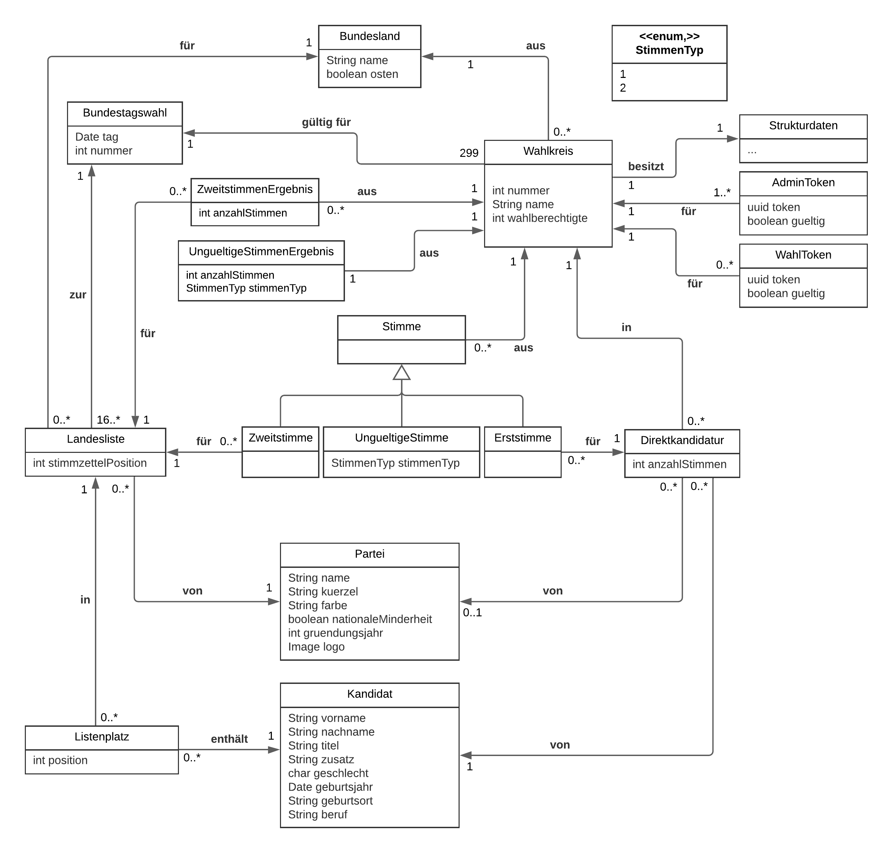

# Dokumentation

# Datenbankmanagementsystem
Der Einsatz eines Datenbankmanagementsystems für ein Wahlinformationssystem ist mit verschiedenen Vor- und Nachteilen verbunden.

## Vorteile
- Persistenz von systemrelevanten Daten (Schutz vor Datenverlust)
- Performanz bei großen Datenmengen
- Datenkonsistenz, z.B. verhindern, dass ein Kandidat in mehreren Wahlkreisen
 antritt
- Zugriffskontrolle möglich
- Mehrbenutersynchronisation am Wahltag wichtig
- automatisierte Auswertung der Wahldaten
- kein zusätzlicher Entwicklungsaufwand für ein eigenes System für die Persistierung der Daten

## Nachteile
- komplizierte Abfragen
- Zugriff auf Datenbankmanagementsystem benötigt Know-How
- Falls Datenbankmanagementsystem nicht verteilt: Single Point of Failure
- Abhängigkeit von Entwicklern des Datenbankmanagementsystems

## Relevante Daten
Für den Entwurf des Wahlinformationssystem ist im ersten Schritt eine Auseinandersetzung mit der Domäne erforderlich.
Die Identifikation der Daten, welche vom System verwaltet werden müssen unter Beachtung von Datenschutzrichtlinien erfolgt mit der Beantwortung von W-Fragen.

### Wie wird gewählt?
- jeder/jede Wahlberechtigte gibt in genau einem **Wahlkreis** eine oder keine Stimme ab
- Stimmzettel bestehend aus **Erst**- und **Zweitstimme**
- **Erst**- und/oder **Zweitstimme** können potentiell ungültig sein

### Wer darf wählen?
- wahlberichtigte deutsche Staatsbürger/innen
- Wahlberechtigte werden aus Datenschutzgründen nicht einzeln in der Datenbank modelliert.

### Wo wird gewählt?
- in 299 **Wahlkreisen** aufgeteilt auf 16 **Bundesländer**
- **Wahlkreise** bestehen aus Gemeinden
- jede Gemeinde ist in genau einem **Wahlkreis**
- Aufteilung von Gemeinden auf **Wahlkreise** kann sich von **Wahl** zu **Wahl** ändern

### Was wird gewählt?
- Bundestag wird gewählt mit vorgesehener Größe von 598 Mandaten
- Aufteilung der Mandate auf die **Bundesländer** entsprechend der **Bevölkerung**
- mit **Erststimme**: Wahl eines **Direktkandidierenden** aus dem **Wahlkreis**, der einer **Partei** angehören kann oder nicht
- **Kandidierender** mit meisten **Erststimmen** erhält Direktmandat
- mit **Zweitstimme**: Wahl einer im **Bundesland** des **Wahlkreises** kandidierenden **Partei**
- Ergebnis aller **Zweitstimmen** gibt Aufteilung der Mandate für **Bundesland** an
- Vergabe der Mandate von **Zweitstimmen** über **Landeslisten** von **Parteien**
- Vergabe der Mandate für eine **Partei** in einem **Bundesland** entsprechend der Reihenfolge der **Landesliste**
- als **Kandidierender** möglicherweise **Direktkandidatur** und Position auf **Landesliste** (eventuell sogar für unterschiedliche **Parteien**)
- **Kandidierende** können bei verschiedenen **Wahlen** für verschiedene **Parteien** kandidieren
- **Direktkandidaturen** und Position auf **Landeslisten** unabhängig

### Wann wird gewählt?
- alle vier Jahre

## UML-Modell
Das Datenmodell basiert auf den identifizierten Entitäten, die im Datenbankmanagementsystem verwaltet werden müssen. 

## Ablauf der Stimmabgabe

- TODO
- Trigger beschreiben