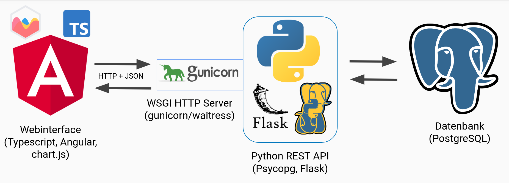
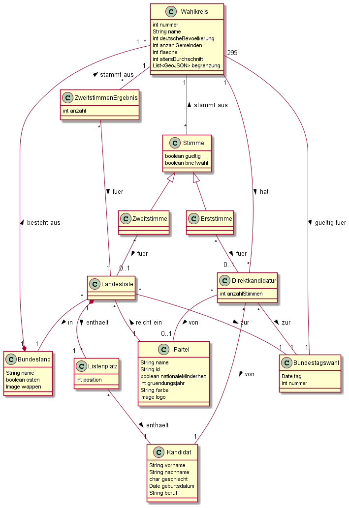

# Pflichtenheft

## Zielsetzung

### Musskriterien
- Speichern aller relevanten Daten (siehe Datenmodell) für die BTW
  - insbesondere aggreggierte Ergebnisse pro Wahlkreis
- Sitzverteilung des Bundestags
  - Berechnung der Verteilung auf die Parteien unter Beachtung von Sonderregeln:
    - Überhangsmandate (außer die ersten drei)
    - nationale Minderheiten
    - 5%-Hürde
  - Ausgabe der Anteile und Sitze pro Partei
  - Visualisierung als Diagramm
  - Bestimmung des Mandatstyps (Überhangsmandat, Direktmandat, Listenmandat)
  - Besetzung der Sitze mit Kandidaten
  - Neuberechnung mit Einzelstimmen in < 5s
  - Neuberechnung mit Aggregationen in < 1s
- Möglicher Vergleich aller Ausgaben (von 2021) mit der Wahl 2017
- Stimmabgabe durch Benutzer
  - Einzeln
  - Batch-Loading und Umwandlung in Einzelstimmen

### Sollkriterien
- ausführliche Dokumentation und Versionierung
- Ausgabe von gespeicherten Daten
  - Parteien
  - Wahlkreise (inklusive Wahlkreisinformationen)
  - Kandidaten
  - Landeslisten
- Ausgabe von Statistiken
  - Erst- und Zweitstimmenergebnis für ein Bundesland oder einen Wahlkreis
  - Anteil Briefwahl
  - Anteil ungültiger Stimmen
- interaktive Karte Deutschlands
  - in Wahlkreise und Bundesländer unterteilt
  - Darstellung der jeweiligen Ergebnisse (Erst-/Zweitstimme)

### Kannkriterien
- Filter und Suche in den Daten
- Weitere visuelle Darstellung
  - Heatmap für jede Partei, die zeigt in welchen Gebieten eine Partei am 
    stärksten abgeschnitten hat
- Weitere Statistiken
  - knappster/deutlichster Erststimmensieg
  - Wählerumzug (innerhalb von Wahlkreisen)
  - größter Gewinner/Verlierer
  - Frauenanteil im Bundestag
  - Gegenüberstellung von alten und neuen Bundesländern

### Abgrenzungskriterien
- keine Möglichkeit eigene (SQL-)Anfragen zu formulieren
- keine Einzelstimmen für Wahlen vor 2021
- keine Neuberechnung des Bundestags bei *jeder* Abfrage
- keine personenbezogenen Daten (insbesondere über Wähler) speichern

## Technische Umsetzung

### Datenbankmanagementsystem
- [PostgreSQL](https://www.postgresql.org/) zum Management aller persistenten 
  Daten
- Erstellung von Views für zu berechnende Daten. Zur Abfrage wird 
  lediglich "SELECT * FROM view;" benötigt.
  - Wahlkreissieger 
  - Überhangsmandate
  - Sitzverteilung
  - Verschiedene Statistiken

### Backend
- Python + [Flask](https://flask.palletsprojects.com/en/2.0.x/)
  - Entegegennehmen der REST-API Aufrufe
  - Delegation zum DBMS ([psycopg](https://www.psycopg.org/))
  - JSON als Nachrichtenformat
  - Berechnung der tatsächlichen Wahlkreisgrenzen als (konkaves) Polygon

### Frontend
- [Angular](https://www.angular.io/) mit Typescript
- [Mapbox GL JS](https://github.com/mapbox/mapbox-gl-js)
  - interaktive Map
  - Wahlkreisgrenzen als GeoJSON
- Verschiedene Bibliotheken zur Visualisierung
  - Balkendiagramme
  - Sitzverteilung

### Infrastruktur
- [nginx](https://www.nginx.com/) als Webserver für statische Dateien und 
  das Frontend
- [Docker](https://www.docker.com/) zum Verpacken und Ausführen der 
  Komponenten als Container --> Erhöhte Portabilität
- Alle Komponenten sollen auf einer Hostingplattform 
  für Container / vServer gehostet werden.

## Datenmodell

## GUI-Mockup
[Link zu Figma](https://www.figma.com/file/mWyTVjiFh8bLU6Wr6T6HrN/Datenbankenprojekt?node-id=0%3A1)

### Hinweise zur Zugangsberechtigung

- Stimmabgaben sind nur in Kombination mit einem gültigen Schlüssel möglich.
- Es werden keine Nutzerkonten verwaltet.

## Glossar
 - *BTW*: Bundestagswahl
 - *DBMS*: Datenbankmanagementsystem
 - *REST*: Representational State Transfer
 - *GUI*: Graphical User Interface
 - *SQL*: Structured Query Language
 - *JS*: JavaScript
 - *JSON*: JavaScript Object Notation