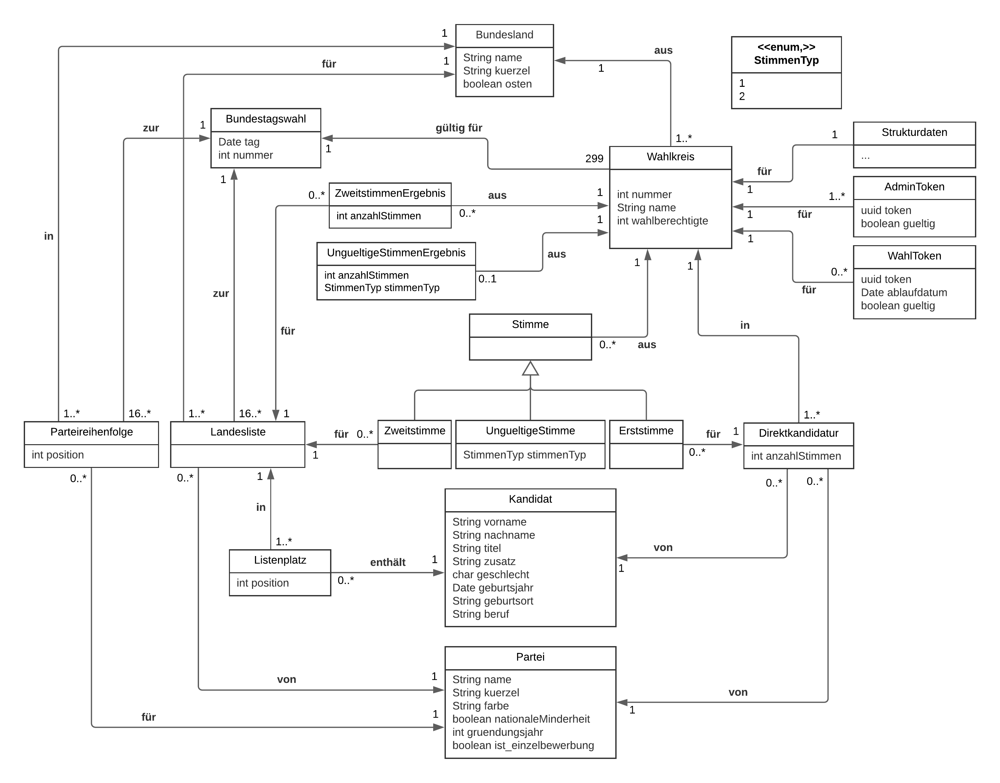

# Pflichtenheft

## Zielsetzung

### Musskriterien
- Speichern aller relevanten Daten (siehe Datenmodell) für die BTW
  - insbesondere aggreggierte Ergebnisse pro Wahlkreis
- Sitzverteilung des Bundestags
  - Berechnung der Verteilung auf die Parteien unter Beachtung der folgenden Sonderregeln:
    - Überhangsmandate (außer den ersten drei Überhangsmandaten pro Partei, welche seit der Bundestagswahl 2021 nicht mehr ausgeglichen werden)
    - nationale Minderheiten
    - 5%-Hürde
  - Ausgabe der Größe des Bundestags
  - Ausgabe der Anteile und Sitze pro Partei
  - Visualisierung als Donut-Diagramm
  - Bestimmung des Mandatstyps (Direktmandat, Listenmandat)
  - Besetzung der Sitze mit Kandidaten für die Bundestagswahl 2021
  - Neuberechnung der mit Einzelstimmen in < 5s
  - Neuberechnung mit Ergebnissen aggregiert pro Wahlkreis in < 1s
- Vergleich aller berechneter Ausgaben für die Bundestagswahl 2021 mit der Wahl 2017
- Ausgabe von Statistiken
  - Erst- und Zweitstimmenergebnis für ein Bundesland oder einen Wahlkreis
  - knappste Siege/Niederlagen bezüglich Erststimmen in einem Wahlkreis
  - Anzahl an Überhangsmandaten
- Stimmabgabe durch Benutzer
- Batch-Loading der für die Bundestagswahlen 2017 und 2021 relevanten Daten und Umwandlung in Einzelstimmen (für mindestens fünf Wahlkreise)

### Sollkriterien
- ausführliche Dokumentation und Versionierung
- Ausgabe von gespeicherten Daten
  - Parteien
  - Kandidatinnen und Kandidaten (nur von der Bundestagswahl 2021)
  - Landeslisten (nur von der Bundestagswahl 2021)
- Ausgabe von Statistiken
  - Wahlergebnis in östlichen Bundesländern
- interaktive Karte Deutschlands
  - in Wahlkreise unterteilt
  - Färbung entsprechend der Wahlkreissieger für Erst- und Zweitstimmen

### Kannkriterien
- filtern der Daten sowie suchen in den Daten
- Erweiterung der Funktionalitäten der interaktiven Deutschlandkarte
  - Heatmap für jede Partei, die zeigt in welchen Gebieten eine Partei am 
    stärksten abgeschnitten hat
- weitere Statistiken
  - Vergleichsstatistiken basierend auf Strukturdaten der einzelnen Wahlkreise

### Abgrenzungskriterien
- keine Möglichkeit für Anwender eigene (SQL-)Anfragen zu formulieren
- keine Einzelstimmen für Wahlen vor 2021
- keine Neuberechnung des Bundestags bei *jeder* Abfrage
- keine personenbezogenen Daten (insbesondere über Wähler) speichern (insbesondere keine Benutzerverwaltung)

## Technische Umsetzung


### Datenbankmanagementsystem
- [PostgreSQL](https://www.postgresql.org/) zum Management aller persistenten 
  Daten
- Für die zu berechnenden Daten werden (materialisierten) Views erstellt. Zur Abfrage werden dann lediglich Abfragen der Form ```SELECT * FROM view;``` benötigt.
  - Wahlkreissieger
  - Überhangsmandate
  - Sitzverteilung
  - Wahlmöglichkeiten auf Stimmzettel
  - verschiedene Statistiken

### Backend
- Python mit [Flask](https://flask.palletsprojects.com/en/2.0.x/)
  - Entegegennehmen der REST-API Aufrufe
  - Delegation zum DBMS ([psycopg](https://www.psycopg.org/))
  - JSON als Nachrichtenformat
  - Extrahieren der relevanten Informationen mit Kerg von [bundeswahlleiter.de](https://www.bundeswahlleiter.de/)
- für Ausführung in Production [gunicorn](https://gunicorn.org/) oder [Waitress](https://github.com/Pylons/waitress)

### Frontend
- [Angular](https://www.angular.io/) mit Typescript
- SVG für die Darstellung der interaktiven Deutschlandkarte
- [Chart.js](https://www.chartjs.org/) Bibliothek zur Visualisierung mit Diagrammen

### Infrastruktur
- [Heroku](https://www.nginx.com/) für Hosting
  - Datenbank (PostgreSQL-Datenbanken können gratis erstellt werden)
  - Backend
  - Frontend
- [GitLab](https://about.gitlab.com/de-de/) GitLab
  - Versionierung
  - Code-Reviews und Merge-Request
  - Issue-Tracking
  - CI/CD-Pipelines (Frontend-Deployment, Backend-Deployment und Ausführung von Tests)

## Datenmodell



## GUI-Mockup
[Link zu Figma](https://www.figma.com/file/mWyTVjiFh8bLU6Wr6T6HrN/Datenbankenprojekt?node-id=0%3A1)

### Hinweise zur Zugangsberechtigung

- Stimmabgaben sind nur in Kombination mit einem gültigen Schlüssel möglich.
- Es werden keine Nutzerkonten verwaltet.

## Glossar
 - *BTW*: Bundestagswahl
 - *DBMS*: Datenbankmanagementsystem
 - *REST*: Representational State Transfer
 - *GUI*: Graphical User Interface
 - *SQL*: Structured Query Language
 - *JS*: JavaScript
 - *JSON*: JavaScript Object Notation
 - *CI*: Continuous Integration
 - *CD*: Continuous Deployment
 - *SVG*: Scalable Vector Graphics